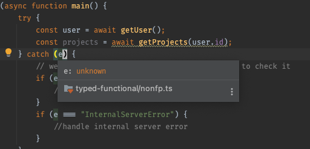
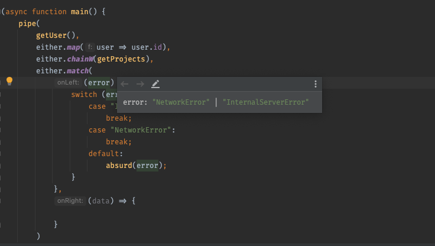

# Typed functional programming
## fp-ts
[Documentation](https://gcanti.github.io/fp-ts)

* Mature library 
* Takes common abstraction and patterns from another languages and transform them to typescript
* Inspired by Haskell, PureScript, Scala

## Advantages
Speaker was presenting advantages on example where he has to get user first and then based on result of user get his projects.

### Presented problem:
```ts
type NetworkError = "NetworkError";
interface User {
  id: string;
  name: string;
}
function getUser(): User {
  throw "NetworkError";
}

interface Project {
  id: string;
  mandays: number;
}

function getProjects(userId: string): Project[] {
  throw "InternalServerError";
}

(async function main() {
  try {
    const user = await getUser();
    const projects = await getProjects(user.id);
  } catch (e) {
    // we dont know what error can be and we have to check it
    if (e === "NetworkError") {
      //handle network error
    }
    if (e === "InternalServerError") {
      //handle internal server error
    }
  }
})();
```


Main problem with this piece of code is that we don't know what could happen, because its not exactly documented with types. Type of error in catch statement is of type unknown as you can see
in picture above so we have to manually detect what have happened. 

### Presented solution 
```ts
import {Either} from "fp-ts/Either";
import {either} from "fp-ts";
import {absurd, pipe} from "fp-ts/function";

function getUser(): Either<NetworkError, User> {
    return either.left("NetworkError");
}

function getProjects(userId: string): Either<InternalServerError, Project[]> {
    return either.left("InternalServerError")
}

(async function main() {
    pipe(
        getUser(),
        either.map(user => user.id),
        either.chainW(getProjects),
        either.match(
            (error) => {
                switch (error) {
                    case "InternalServerError":
                        break;
                    case "NetworkError":
                        break;
                    default:
                        absurd(error);
                }
            },
            (data) => {

            }
        )
    )
})();
```


In functional programming realm we start to work with monadic data type Either. Either type has 2 sides. Left side represents error state and right one represents data.
Operations on either type can be composed with pipe function, chain presented in code example above is getting user data first, then maps user to his id and based on id get project.
What have to be mentioned is that when any function in the chain returns left side, all operations on right will not run.
Final result of this chain is then processed in match function. Because we have used either type typescript knows that error can be type of `NetworkError`,
which can happen inside getUser function or `InternalServerError`, which could happen inside getProjects function. You can see type hints from typescript on picture above.
Based on this knowledge we can even use [exhaustive type checking](https://medium.com/technogise/type-safe-and-exhaustive-switch-statements-aka-pattern-matching-in-typescript-e3febd433a7a)
with `absurd` function, which accepts type never as param. With exhaustive type checking typescript knows that all possible errors are covered inside switch statement, so when new
type of error arise, typescript will yell with type error.


### Meetup recording
Meetup was recorded and can be found on [youtube](https://www.youtube.com/watch?v=ZSA8vKeZ160), unfortunately only in Czech.
