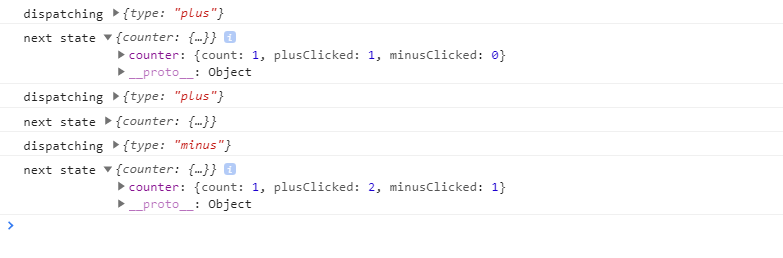
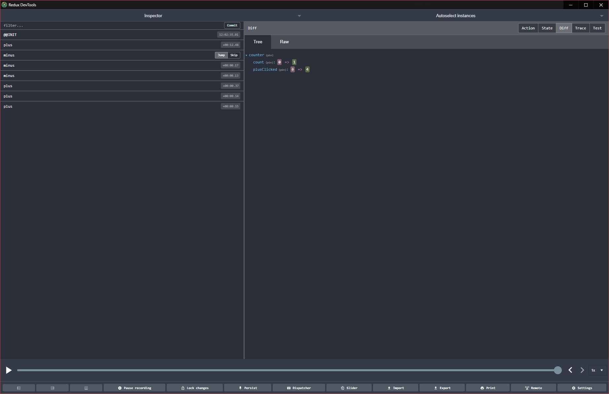

#EMBRACE POWER OF COMMUNITY
## aneb integrujeme redux
Chtě nechtě, světem hýbe flex architektura. Výhody, které nám tato architektura přináší, utloukají jeho nevýhody. Osobně se
mi líbí pojetí reduxu k implementaci fluxu, za prvé architekturou. A za druhé možnostmi debugování a
 pluginizovatelností na bázi middlewérů (češtináři prominou).
 
## Co je to ten flux?
Flux je návrhový vzor jehož hlavní myšlenkou je unidirectional data flow, tedy data se nám pohybují jen jedním směrem.

V prvopočátku je vygenerovaná initial akce, která ziniciuje celý stavový objekt. Všechny akce nadále prochází skrz
 dispečera, který akci přeposíla na stavové akce nebo obecně nějaké místo kde se akce zpracovávají a na jejich základu 
 se mění stav. Jakmile je akce zpracovaná, tedy máme novou verzi stavu rozposíláme ho komponentám, které renderují
 obsah uživateli. Na bázi uživatelské interakce s vyrenderovaným obsahem se generují akce. A v tomhle kolečku se pak 
 točíme až dokud žije naše aplikace.
 
## Redux pojetí
Do flux architektury redux přidává ještě další vrstvy, které je možné vidět na schématu.

Tyto vrstvy jsou přidány pro lepši práci se stavem na úrovni komponent v případě vrstvy nacházející se nad samotným
 view, případně pro již zmíněnou pluginizovatelnost u vrstvy stojící nad storem. Je to celkem těžké téma ale doufám
 , že dále to bude jasnější.
 
 ## Redux řečí kodu
 [CodeSandbox](https://codesandbox.io/s/icy-bird-fc78d)
 ### Disclaimer
 Pro jednoduchost budou přeskošeny některé vrstvy a použití se bude blížít schématu fluxu
 
 
 Nebyla by to správná osvěta, kdyby jsme nenapsali aspoň jeden counter. Pro základ reduxu se pojďme podívat na čist
 ý javascript. Naše view bude postavené nad následujícím aplikačním stavem:
 ```typescript
interface CounterShape {
  count: number;
  plusClicked: number;
  minusClicked: number;
}

interface StateShape {
  counter: CounterShape;
}
```
 
 Nejdříve render metoda:
 ```typescript
function render() {
  const state = store.getState();
  document.getElementById("app").innerHTML = `
<h1>Counter!</h1>
<div>Count is: ${state.counter.count}
<div>
  <button onclick="createPlusAction()">
    +
  </button>
  Times called: ${state.counter.plusClicked}
</div>
<div>
  <button onclick="createMinusAction()">
    -
  </button>
  Times called: ${state.counter.minusClicked}
</div>
`;
}
```
Jak je z příkladu vidět. Jsme na view vrstvě, kde budeme zobrazovat data uložená "někde" a to někde znamená v globáln
ím stavu. Dále na buttonu + a - navazujeme handlery, které budou generovat akce. Tyto handlery mají následující podobu:
```typescript
(<any>window).createPlusAction = function createPlusAction() {
  store.dispatch({ type: CounterActionType.PLUS });
};

(<any>window).createMinusAction = function createPlusAction() {
  store.dispatch({ type: CounterActionType.MINUS });
};
```
Nedělají nic jiného, než že zavolají dispatch funkci s definicí akce, která se má provést. Definování je dáno typem
 akce. Dále je potřeba dopsat obsluhu akcí.
 ```typescript
const counter = (
  state: CounterShape = createDefaultState(),
  action: r.Action
) => {
  switch (action.type) {
    case CounterActionType.PLUS:
      return {
        ...state,
        count: state.count + 1,
        plusClicked: state.plusClicked + 1
      };
    case CounterActionType.MINUS:
      return {
        ...state,
        count: state.count - 1,
        minusClicked: state.minusClicked + 1
      };
    default:
      return state;
  }
};
```
Obsluha = funkce, v terminologii reduxu o obsluze hovoříme jako o reduceru, do které na vstupu přichází současný stav a
 akce a právě obsluhovaná akce. Na základě typu akce se pak na úrovni reduceru rozhodujeme zda budeme reagovat či ne
 , tedy vytvoříme novou instanci stavu nebo ne. Důležité je si všimnout prvního parametru funkce, kterému dáváme
  defaultní (inicializační) hodnotu.
 
Abychom uzavřeli kolečko je ješte nutné dát view vrstvě vědět, že se má překreslit protože proběhla změna stavu.
```typescript
    store.subscribe(() => render());
```
Pouze posloucháme na změny stavu a při každé přerenderováme.

Ve chvílí kdy máme uzavřené kolečko, je možné celou aplikaci spustit. Nejprve ziniciujeme redux store a následně pust
íme první render:
```typescript
const store = r.createStore(r.combineReducers({ counter }));
render();
```
Funkci combine reducers můžete vypustit. Je zde čistě kvůli tvaru stavu a na funkcionalitu nemá vliv.

## Síla architektury
[CodeSandbox](https://codesandbox.io/s/determined-fog-hsfhu)
Představte si, že naše aplikace je daleko složitějšího rázu a akce jsou například generované nejen uživatelem, ale i
 serverem ze kterého nám chodí notifikace o změnách a my bychom chtěli logovat všechny akce, které ovlivňují stav
 . Pro tyto účely slouží vrstva stojící mezi dispečerem a reducery, tedy již zmíněné middlewéry. Napíšeme tedy prost
 ředníka, který bude akce zaznamenávát a zároveň nám řekne jaký je stav po obsluze akce
 
 ```typescript
    const logger = store => next => action => {
      console.log('dispatching', action);
      let result = next(action);
      console.log('next state', store.getState());
      return result;
    }
```
A ještě je zapotřebí reduxu řící, že tohoto prostředníka chceme použit. K tomu slouží druhý parametr funkce
 createStore, kterou jsme používaly pri inicializaci storu.
 ```typescript
const store = r.createStore(r.combineReducers({ counter }), r.applyMiddleware(logger));
```


### Redux devtools
Pro kompletní dohled nad tím jak zrovna vypadá aplikační stav a které ho ovlivňují akce vznikl plugin do chromu redux
 devtools. Pro jeho integraci stačí aplikovat prostředníka který s tímto nástrojem dokáže komunikovat. Nástroj vypad
 á následujícím způsobem: 
 
 Je možné si v něm prohlížet jak se měnil stav v čase a jaké akce ho měnili. Dokonce cestovat v čase a vracet se do p
 ředchozího stavu aplikace. Více o konfiguraci přímo v dokumentaci [extensiony](https://codesandbox.io/s/determined-fog-hsfhu).
 Devtools nefungují v kooperaci s codesandbox, pro zkoušku je nutné si pojekt rozjet lokálně. Hotový example je
  dostupný [zde](https://codesandbox.io/s/priceless-water-51kte). Stačí stáhnout a pustit
  ```shell script
npm install & npm start
```

## Bobril + redux = ♥ ?
###Disclaimer 
Pro nevzdalování se od komunity vezmeme jako referenční api react-redux implementaci.

## Kde držet store?
První otázka která vyvstane na mysli ve chvíli kdy přemýšlíme o integraci bobrilu a reactu je kde udržovat stav
 aplikace. Je window jako v prvním případě opravdu to správné místo? Co když v rámci jednoho okna běží více
  javascriptů které přistupují na window. Nebudu se clashovat používané window namespacy? Ale máme přeci i lepší m
  ísto: CONTEXT.

 

